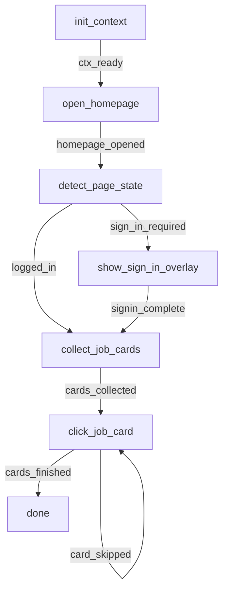

# Indeed Bot - Standards-Compliant Implementation

## Overview

Standards-compliant Indeed bot built with **Playwright + Camoufox** for superior anti-detection capabilities while maintaining full BOT_STANDARDS.md compliance.

## Architecture Decision: Hybrid Browser Strategy

### ✅ **Recommendation: Use Both Chrome AND Camoufox**

| Bot | Browser | Reason |
|-----|---------|--------|
| **Seek** | Chrome/Selenium | ✅ Working perfectly with session persistence |
| **Indeed** | Camoufox/Playwright | ✅ Better anti-detection for stricter sites |
| **Future bots** | Choose based on site requirements | ✅ Flexibility is our strength |

**Why not migrate everything to Camoufox?**
- Seek's Chrome implementation is stable and working
- Different sites need different approaches
- Maintenance overhead of migration not justified
- Having both tools gives maximum flexibility

---

## 🚀 Quick Start

### Run the Indeed Bot

```bash
# Test the bot (headful mode for debugging)
bun src/bots/indeed/test_indeed_basic.ts

# Run via bot_starter
bun src/bots/bot_starter.ts indeed

# Headless mode
HEADLESS=true bun src/bots/bot_starter.ts indeed
```

---

## 📂 Directory Structure

```
src/bots/indeed/
├── indeed_impl.ts              # Main implementation (5 core functions)
├── indeed_steps.yaml           # Workflow definition
├── config/
│   └── indeed_selectors.json   # DOM selectors
├── handlers/                   # Future: specialized handlers
├── tests/
│   └── test_indeed_basic.ts    # Basic test
├── old/                        # Previous implementation (archived)
│   ├── indeed_standards.js
│   └── indeed_steps.yaml
└── README.md                   # This file
```

---

## 🧩 Core Components

### 1. **browser_manager_playwright.ts**
- Camoufox browser initialization
- Session management with cookie persistence
- Anti-fingerprinting measures
- Profile directory management

**Key Features:**
- ✅ Auto-save cookies every 60 seconds
- ✅ Session restoration on restart
- ✅ Stealth mode (removes webdriver property)
- ✅ Firefox-based (Camoufox) for better evasion

### 2. **universal_overlay_playwright.ts**
- Playwright-compatible overlay system
- Persistent across page navigations
- Job progress tracking
- Sign-in prompts

**Overlay Functions:**
- `showJobProgress()` - Display application progress
- `updateJobProgress()` - Update progress dynamically
- `showSignInOverlay()` - Prompt for manual login
- `showNotification()` - Display alerts

### 3. **indeed_impl.ts**
Five core functions following BOT_STANDARDS.md:

| Step | Function | Purpose |
|------|----------|---------|
| 0 | `step0()` | Initialize context, load config/selectors |
| 1 | `openHomepage()` | Setup Camoufox browser, navigate to Indeed |
| 2 | `detectPageState()` | Check if logged in or sign-in required |
| 3 | `showSignInOverlay()` | Display manual login prompt |
| 4 | `collectJobCards()` | Extract job listings from page |
| 5 | `clickJobCard()` | Click job card and load details |

---

## 🔧 Configuration

### Required Files

1. **`src/bots/core/user-bots-config.json`**
```json
{
  "formData": {
    "keywords": "software engineer",
    "locations": "New York",
    "enableDeepSeek": true,
    "deepSeekApiKey": "your-key-here",
    "acceptTerms": true
  }
}
```

2. **`src/bots/indeed/config/indeed_selectors.json`**
Already configured with comprehensive selector fallbacks.

---

## 🎯 Standards Compliance

### ✅ BOT_STANDARDS.md Requirements Met

| Requirement | Status | Implementation |
|-------------|--------|----------------|
| Directory structure | ✅ | `indeed/` with impl, yaml, config/ |
| `step0` context init | ✅ | Loads selectors & config |
| Browser setup | ✅ | `openHomepage()` with Camoufox |
| AsyncGenerator functions | ✅ | All functions use `async function*` |
| Event yielding | ✅ | All transitions defined |
| Overlay integration | ✅ | UniversalOverlayPlaywright |
| Export pattern | ✅ | `indeedStepFunctions` object |
| YAML workflow | ✅ | `indeed_steps.yaml` |
| Selectors JSON | ✅ | `config/indeed_selectors.json` |
| Error handling | ✅ | Try-catch with event yields |
| Logging | ✅ | `printLog()` throughout |

---

## 🔄 Workflow Flow



---

## 🐛 Key Differences from Seek Bot

| Aspect | Seek Bot | Indeed Bot |
|--------|----------|------------|
| **Browser** | Chrome (Selenium) | Camoufox (Playwright) |
| **Driver** | `WebDriver` | `Page` |
| **Overlay** | `UniversalOverlay` | `UniversalOverlayPlaywright` |
| **Context** | `ctx.driver` | `ctx.page` |
| **Element Selection** | `findElement(By.css())` | `page.$$()` or `page.$()` |
| **Script Execution** | `executeScript()` | `page.evaluate()` |
| **Navigation** | `driver.get()` | `page.goto()` |
| **Waits** | `driver.sleep()` | `page.waitForTimeout()` |

---

## 🛠️ Development Guide

### Adding New Steps

1. **Add function to `indeed_impl.ts`:**
```typescript
export async function* myNewStep(ctx: PlaywrightWorkflowContext): AsyncGenerator<string, void, unknown> {
  try {
    printLog("Doing something...");
    // Your logic here
    yield "step_completed";
  } catch (error) {
    printLog(`Error: ${error}`);
    yield "step_failed";
  }
}
```

2. **Add to export object:**
```typescript
export const indeedStepFunctions = {
  step0,
  openHomepage,
  // ... existing functions
  myNewStep,  // ← Add here
};
```

3. **Define in YAML:**
```yaml
my_new_step:
  step: 6
  func: "myNewStep"
  transitions:
    step_completed: "next_step"
    step_failed: "retry_step"
  timeout: 30
  on_timeout_event: "step_failed"
```

---

## 🧪 Testing

### Manual Testing
```bash
# Run with browser visible
bun src/bots/indeed/test_indeed_basic.ts

# Monitor console for:
# ✅ Browser initialization
# ✅ Overlay appearance
# ✅ Page navigation
# ✅ Job card collection
```

### Integration with Bot Runner
```bash
# Standard execution
bun src/bots/bot_starter.ts indeed

# With options
HEADLESS=true bun src/bots/bot_starter.ts indeed --close
```

---

## 📊 Overlay Usage

### Initialize Progress
```typescript
await ctx.overlay.showJobProgress(0, totalJobs, "Starting...", 4);
```

### Update Progress
```typescript
await ctx.overlay.updateJobProgress(
  appliedJobs,
  totalJobs,
  "Applied to Software Engineer role",
  5
);
```

### Show Sign-In Prompt
```typescript
await ctx.overlay.showSignInOverlay();
// Waits for user to click "Continue"
```

---

## 🚧 Known Limitations

1. **Playwright Context Typing:**
   - Extended `WorkflowContext` to include `page`, `browser`, `context`
   - May need type adjustments as workflow engine evolves

2. **Session Persistence:**
   - Currently saves cookies only
   - Full profile persistence available but commented out

3. **Job Application:**
   - Currently only navigates and collects jobs
   - Application logic to be added in future steps

---

## 📈 Next Steps

### Phase 2: Job Application (Steps 6-10)
- [ ] Detect Apply button type (Indeed Apply vs External)
- [ ] Click Indeed Apply button
- [ ] Handle resume selection
- [ ] Fill application forms
- [ ] Submit applications

### Phase 3: Advanced Features
- [ ] Cover letter handler
- [ ] Employer questions handler
- [ ] Application tracking
- [ ] Multi-page pagination

### Phase 4: Error Handling
- [ ] Captcha detection
- [ ] Rate limiting
- [ ] Network error recovery

---

## 💡 Tips & Tricks

### Debugging Overlay
```typescript
// Check if overlay is visible
const overlayExists = await ctx.page.evaluate(() => {
  return document.getElementById('universal-overlay') !== null;
});
console.log('Overlay visible:', overlayExists);
```

### Session Management
```bash
# Session saved at:
sessions/indeed/profile/cookies.json

# Clear session:
rm -rf sessions/indeed/profile/
```

### Camoufox vs Chrome Decision
**Use Camoufox when:**
- Site has aggressive bot detection
- Cloudflare challenges are common
- Need maximum stealth

**Use Chrome when:**
- Session persistence is critical
- Site works fine with Chrome
- Existing implementation is stable

---

## 🤝 Contributing

When adding features:
1. ✅ Follow BOT_STANDARDS.md
2. ✅ Use `async function*` generators
3. ✅ Yield events for all transitions
4. ✅ Update YAML workflow
5. ✅ Add to `indeedStepFunctions` export
6. ✅ Test with overlay

---

## 📞 Support

Issues? Check:
1. Camoufox installed: `bun install`
2. Config file exists: `src/bots/core/user-bots-config.json`
3. Selectors up-to-date: Indeed may change DOM structure
4. Session clean: `rm -rf sessions/indeed/` and retry

---

## 📝 License

Same as parent project.

---

**Built with ❤️ using Camoufox, Playwright, and the Workflow Engine**
